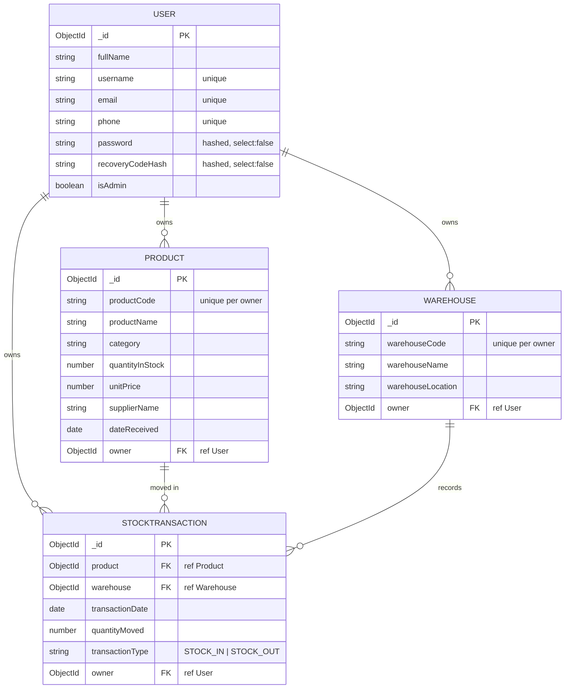

# Stock Management System (SMS) — Entity Relationship Diagram

StockHub Ltd · Stock Management System

## Relationships inferred from the attributes

- **User ||--o{ Product** — `Product.owner` references `User`; one user owns many products (per-user data visibility).
- **User ||--o{ Warehouse** — `Warehouse.owner` references `User`; one user owns many warehouses.
- **User ||--o{ StockTransaction** — `StockTransaction.owner` references `User`; one user owns many transactions.
- **Product ||--o{ StockTransaction** — `StockTransaction.product` references `Product`; one product appears in many stock movements (one-to-many).
- **Warehouse ||--o{ StockTransaction** — `StockTransaction.warehouse` references `Warehouse`; one warehouse records many stock movements (one-to-many). `StockTransaction` is the linking entity that records the movement of a product through a warehouse.

