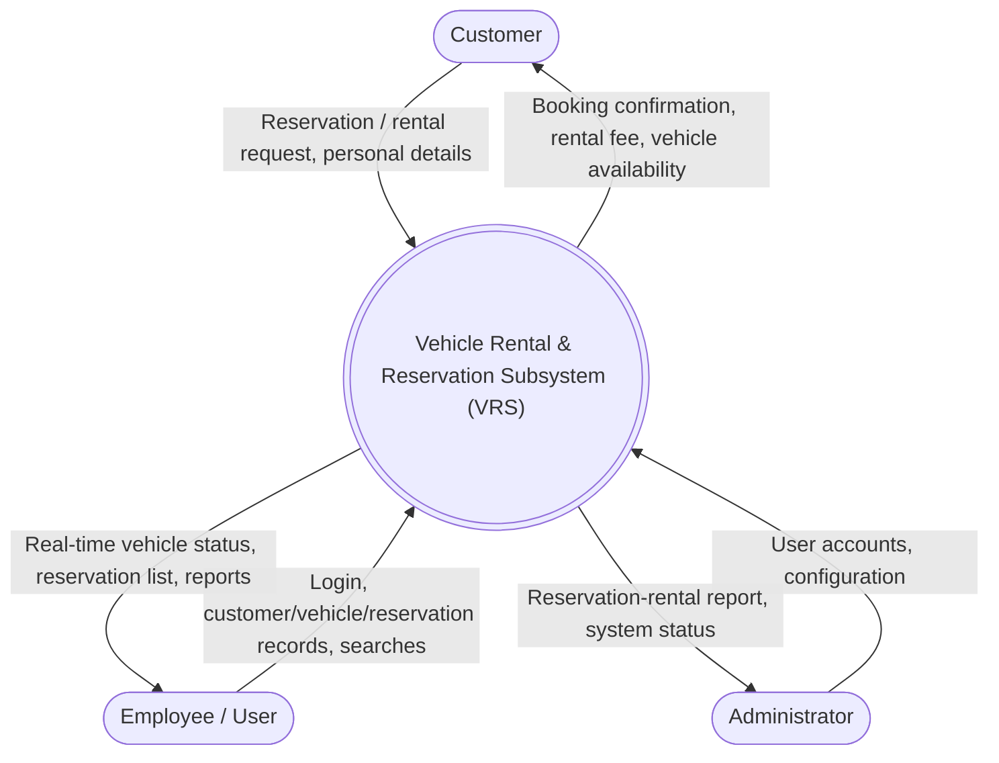

# VRS — Level 0 DFD (Context Diagram)

One central process (the VRS) with its external entities and the labelled data flows in and out.

**Reading it:** Customers submit reservation/rental requests and their details and receive confirmations and fees. Employees (Users) log in to create/read/update/delete and search Customer, Vehicle and Reservation records, and receive real-time status and reports. The Administrator manages user accounts and receives the consolidated Customer–Vehicle Reservation-Rental report.
