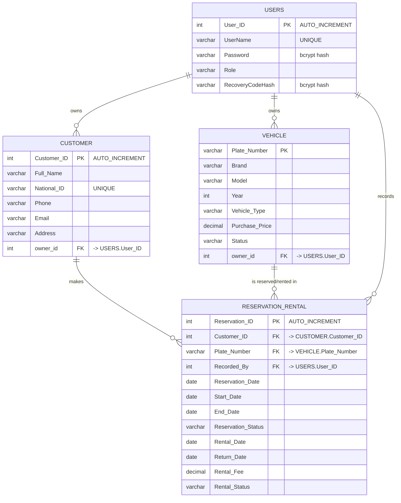

# VRS — Entity Relationship Diagram

Database: **VRS** (MySQL)

- **PK** = Primary Key, **FK** = Foreign Key.
- A Customer makes many reservations/rentals; each reservation belongs to one customer.
- A Vehicle is reserved/rented many times; each reservation involves one vehicle.
- A User records many reservations/rentals; each reservation is recorded by one user.

## Keys summary

| Table | Primary Key | Foreign Keys |
|-------|-------------|--------------|
| Customer | Customer_ID | owner_id → Users(User_ID) |
| Vehicle | Plate_Number | owner_id → Users(User_ID) |
| Reservation_Rental | Reservation_ID | Customer_ID → Customer, Plate_Number → Vehicle, Recorded_By → Users |
| Users | User_ID | — |
